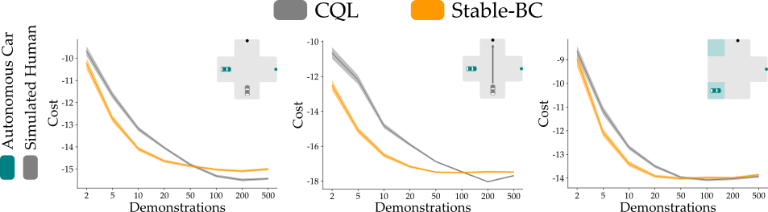

This directory provided the implementation details for an Offline-RL algorithm, Conservative Q-Learning (CQL), in the interactive intersection environment. 

## Environment
The enviornment consists of a simulated human car and a autonomous car trying to cross an intersection, while avoiding a collision.

The autonomous car state $x \in \mathbb{R}^2$ is its position and the action $u \in \mathbb{R}^2$ is the autonomous car's velocity. The environment state $y \in \mathbb {R}^2$ is the state of the simulated human car. In this simulation, the robot knows its dynamics $f(x, u)$, but does not have access to the dynamics of the human car $g(x, y, u)$.

To collect demonstrations in this environment, both the agents optimize for the following cost function from our manuscript:

$$
Cost(x, y, c) = \|\|x(t + \Delta t) - c\|\| - \|\|x(t) - c\|\| + 0.75 \cdot \|\|x(t) - y(t)\|\| - 0.75 \cdot \|\|x(t + \Delta t) - y(t)\|\|
$$

where $c$ is the position of the constant goal in the environment (across the intersection). Similar to our implementation of Stable-BC, each demonstration comprises of 20 datapoints and the reward for each state action pair in the demonstration is computed as 
$$
Reward(x, y, c) = -Cost(x, y, c)
$$

## Implementation
We follow the implementation of CQL provided in [https://github.com/BY571/CQL/tree/main/CQL-SAC](https://github.com/BY571/CQL/tree/main/CQL-SAC). 

To collect demos, train and evaluate the algorithm over 10 independent runs execute the following script
```
python3 train_offline.py --num_demos <number of demos> --test_case <1, 2 or 3> --num_runs 10
```
By default, running this script will create a folder `data/` and store the average performance of the trained CQL policy across 100 rollous in `data/results_rl<test case>_<number of demos>.csv`. The trained policy will be saved in `trained_models/CQL<test case>.pth`.

The three test cases for the evaluation of the CQL algorithm are the same as those described in the manuscript:
- 1: The testing distribution matches the training distribution
- 2: The human behavior is different than that seen during training (simulated human optimizes a different cost function)
- 3: The robot car's initial position is chosen from a distribution different from the one seen during training

## Results
Our results for this experiment are summarized in the figure below. We report the autonomous car's total cost across an interaction, where the cost at current timestep is computed using the cost function defined above. 

To evaluate the robustness of the learned policies, we evaluate each trained policy in three different settings. We start with testing in an environment that exactly matches the training environment (Left Column in the Figure). Next to evaluate the performance of the policy when it comes across data that it has not seen during training, we modify the learning dynamis of $g$ of the human-driven car (Middle column in the figure). In this setting, instead of moving to avoid the autonomous car with dynamics $g(x, y), the human-driven car was self-centered and only reasoned over their own state to reach the goal using dynamics $g(x)$. In our final setting, the initial states of the robot car $x(0)$ were sampled from a different distribution than during training (Right column in the Figure). The human followed the same dynamics $g(x, y)$ as during training, but the autonomous car now had to figure out how to navigate around the workspace and the human from new regions of the workspace. 

<center>
    <div align="center">
        
        <br>
        Figure 1: Comparison of Stable-BC to an Offline-RL algorithm (CQL).
    </div>
</center>

In the figure above, we observe that Stable-BC converges to demonstrator level performance with fewer demonstrations as compared to CQL. However, when both the algorithms have access to large number of demonstrations, Offline-RL may ourperform Stable-BC. We observe this trend due to the interplay of the rewards and the demonstrations. Stable-BC learns to match the behaviors demonstrated by the human experts. Since the experts can be noisy and suboptimal, Stable-BC converges to a suboptimal performance matching that of the experts. Offline-RL is able to overcome these imperfect demonstrations because it has access to the true reward function during training, i. e. it knows what exactly to optimize for. Hence, as expected, Offline-RL can outperform Stable-BC when provided with a sufficient number of noisy and imperfect demonstrations. 

This experiment suggests that when the robot has access to a few demonstrations or the reward function for the task is not readily available (for example in a real world air hockey experiment), Stable-BC can be leverages to achieve a demonstrator level performance while performing the task. However, when we have access to large dataset of demonstrations along with the reward functions for the tasks. Offline-RL can be leveraged to learn a policy that can achieve better-than-demonstrator performance. 